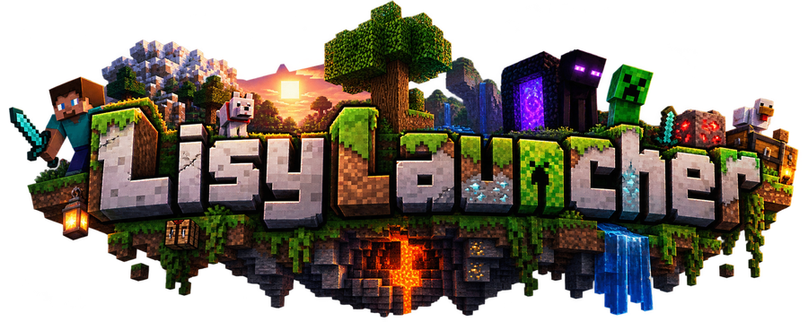

<div align="center">



# 🚀 LisyLauncher

**Android için modern, hızlı ve dokunmatik-öncelikli Minecraft: Java Edition launcher'ı**

[](LICENSE)
[](https://github.com/ThT0AltayHR/L-syLauncher/releases)
[](https://github.com/ThT0AltayHR/L-syLauncher/actions)
[](https://github.com/ThT0AltayHR/L-syLauncher/releases)
[](https://github.com/ThT0AltayHR/L-syLauncher/stargazers)
[](https://lisylauncher.gt.tc)


### ⭐ Projeyi beğendiyseniz bir yıldız bırakmayı unutmayın — yeni sürümlerden haberdar olmanın en kolay yolu bu!

</div>

> [!NOTE]
> **LisyLauncher, resmi olmayan (unofficial) bir değiştirilmiş sürümdür.** Bu proje, [MovTery](https://github.com/MovTery) ve katkıda bulunanlar tarafından geliştirilen açık kaynak **[LisyLauncher2](https://github.com/LisyLauncher/LisyLauncher2)** projesi temel alınarak, [ThT0AltayHR](https://github.com/ThT0AltayHR) ve arkadaşları tarafından geliştirilmektedir. Orijinal LisyLauncher2 projesiyle hiçbir resmi bağlantısı yoktur.

---

## 📋 İçindekiler

- [Özellikler](#-özellikler)
- [Ekran Görüntüleri](#-ekran-görüntüleri)
- [İndirme](#-i̇ndirme)
- [Derleme (Kaynak Koddan)](#-derleme-kaynak-koddan)
- [Sürümler Nasıl Yayınlanır (CI/CD)](#-sürümler-nasıl-yayınlanır-cicd)
- [Lisans ve Kaynak](#-lisans-ve-kaynak)
- [Geliştirici](#-geliştirici)
- [Açık Kaynak Kütüphaneler](#-açık-kaynak-kütüphaneler)

---

## ✨ Özellikler

### 🎮 Oynanış
- **Java Edition, doğrudan Android'de** — kendi Java sürümünüzü (JRE 8/17/21/25 otomatik yönetilir) indirip modlu veya vanilla Minecraft'ı telefon/tablette çalıştırın.
- **Bedrock tarzı dokunmatik kontroller** — varsayılan olarak 4 yönlü D-pad ve tam dokunmatik etkileşim: dokunmak = saldırı, basılı tutmak = yerleştirme/etkileşim. PvP ve Bedwars için hızlı tepki, uzun basmaya gerek yok.
- **Kontrolör/dokunmatik kontrol düzenleyici** — kendi kontrol düzeninizi sürükle-bırak ile tasarlayın.
- **Çoklu render motoru** — OpenGL ES, Vulkan (deneysel), ANGLE, farklı GL4ES varyantları arasında seçim.

### 🧩 Modlar ve İçerik
- **Forge, Fabric, NeoForge, Quilt, OptiFine** kurulum desteği.
- **CurseForge / Modrinth** üzerinden mod ve modpack indirme.
- **Mikrofon gerektiren modlar için otomatik izin akışı** — sesli sohbet/konuşma tanıma kullanan modlar için mikrofon izni otomatik istenir.

### 🎨 Kişiselleştirme
- **Astra teması** — koyu, aurora renkli, profesyonel görünüm; varsayılan olarak etkin.
- **İki hesap seçeneği** — orijinal (Microsoft/Xbox) hesap ve istediğiniz ismi girebileceğiniz çevrimdışı (yerel) hesap yan yana; hesap ekleme ve silme tek dokunuşla.
- Skin görüntüleyici (skinview3d), dosya yöneticisi ve daha fazlası.

### 🌐 Bağlantı ve Entegrasyon
- **Uygulama içi tarayıcı paneli** — oyun içindeyken Discord, Telegram, YouTube ve Chrome'u uygulamadan hiç çıkmadan, yan panelde açın; oturumunuz (çerezleriniz) kalıcı olarak saklanır.
- **Sesli sohbet modları için mikrofon köprüsü** *(deneysel)* — Android'in mikrofonunu AAudio üzerinden doğrudan Java modlarına (`javax.sound.sampled`) tanıtan yerel bir köprü; herhangi bir ek mod ayarı gerekmez. Bu özellik yenidir ve cihazdan cihaza farklılık gösterebilir — sorun yaşarsanız web sitemizden bildirin.
- **[Resmi web sitemiz](https://lisylauncher.gt.tc)** üzerinden duyurular ve hata bildirimi.

### ⚡ Performans
- **Gömülü JVM/GC optimizasyonları** — her başlatmada otomatik devreye girer (bir ayar değildir): G1GC, `DisableExplicitGC`, `UseStringDeduplication` ile ağır modpack'lerde daha az takılma.
- Mobil cihazlar için ayarlanmış varsayılan render mesafesi ve FPS sınırı.
- Güncelleme takibi: bu depodaki GitHub Release'leri izler, kararlı/beta filtreleme ve sürüm geçmişi.

---

## 📸 Ekran Görüntüleri

<div align="center">

**Açılış ekranı** — tam ekran, yatay, sesli oynatılan giriş videosu


</div>

> Diğer ekran görüntüleri için `docs/screenshots/` klasörüne kendi cihazınızdan aldığınız görselleri ekleyip buraya bağlantı verebilirsiniz.

<!--


-->

---

## 📥 İndirme

En güncel kararlı sürümü [**Releases**](https://github.com/ThT0AltayHR/L-syLauncher/releases/latest) sayfasından indirin.

Cihazınızın işlemci mimarisine uygun APK'yı seçin (emin değilseniz `-arm64` sürümü modern telefonların neredeyse tamamında çalışır):

| Dosya | Mimari |
|---|---|
| `LisyLauncher-X.X.X-arm64.apk` | 64-bit ARM (çoğu modern telefon) |
| `LisyLauncher-X.X.X-arm.apk` | 32-bit ARM (eski cihazlar) |
| `LisyLauncher-X.X.X-x86_64.apk` | 64-bit Intel/AMD (bazı tabletler, emülatörler) |
| `LisyLauncher-X.X.X.apk` | Evrensel (tüm mimariler, daha büyük dosya) |

---

## 🛠 Derleme (Kaynak Koddan)

```bash
git clone https://github.com/ThT0AltayHR/L-syLauncher.git
cd L-syLauncher
./gradlew LisyLauncher:assembleRelease
```

**Gereksinimler:**
- Android Studio (güncel bir sürüm önerilir)
- Android SDK — Minimum API 26
- JDK 21

---

## 🔄 Sürümler Nasıl Yayınlanır (CI/CD)

Bu depo GitHub Actions ile **tam otomatik** derleme ve yayınlama kullanır:

1. **Derleme (`build.yml`)** — her push'ta ve her yayınlanan Release'te, 5 farklı mimari (`all`, `arm`, `arm64`, `x86`, `x86_64`) için ayrı ayrı APK derlenir.
2. **İmzalama** — Release derlemeleri, deponun `Settings → Secrets and variables → Actions` bölümünde tanımlı `STORE_PASSWORD` ve `KEY_PASSWORD` gizli anahtarlarıyla otomatik imzalanır. **Bu anahtarlar tanımlı değilse derleme artık başarısız olur ve net bir hata mesajı verir** — böylece imzasız/bozuk bir APK'nın sessizce yayınlanıp cihazlarda *"Paket geçersiz göründüğünden uygulama yüklenemedi"* hatasına yol açması engellenmiş olur.
3. **Yayınlama (`release_ci.yml`)** — bir GitHub Release "published" durumuna alındığında tetiklenir, tüm mimarilerin APK'larını toplar ve doğrudan o Release'e ekler.

Yeni bir depoda otomatik/imzalı derleme için gerekli tek adım: `STORE_PASSWORD` ve `KEY_PASSWORD` gizli anahtarlarını repo ayarlarına eklemek (keystore dosyası zaten kaynak kodda mevcut).

---

## 📜 Lisans ve Kaynak

Bu proje, üzerine inşa edildiği LisyLauncher2 ile aynı şekilde **[GNU General Public License v3.0 (GPLv3)](LICENSE)** ile lisanslanmıştır. Bunun tek bir sebebi var: LisyLauncher2 zaten GPLv3 ile lisanslanmış, ve GPLv3'ün kendisi türev/çatal (fork) projelerin de GPLv3 (veya uyumlu bir lisans) ile dağıtılmasını **zorunlu kılıyor** — yani bu proje başka bir lisansla dağıtılamaz.

GPLv3'ün 7. maddesi uyarınca LisyLauncher2'nin de uyduğu ek şartlar geçerlidir:
- Değiştirilmiş sürümler, orijinal "LisyLauncher"/"ZL" adını veya karıştırılmaya yol açacak benzer bir adı kullanamaz — bu yüzden bu proje **LisyLauncher** adını taşımaktadır.
- Değiştirilmiş sürümler, ana arayüzde bu sürümün "resmi olmayan bir değiştirilmiş sürüm" olduğunu açıkça belirtmelidir (bkz. Ayarlar → Hakkında ekranı).
- Telif hakkı bildirimleri kaynak kod içinde korunmalıdır (korunmuştur).

**Not:** GPLv3, kaynak kodun herkes tarafından çatallanmasını/taşınmasını (port edilmesini) yasaklayan bir maddeye izin vermez; bu yüzden LICENSE dosyasının kendisini bunu yasaklayacak şekilde değiştiremeyiz — böyle bir madde GPLv3 ile çelişir ve hukuken geçersiz olur. Bunun yerine açıkça, kararlılıkla belirtiyoruz: **LisyLauncher, ThT0AltayHR tarafından uzun bir sürede özenle geliştirilmiştir.** Kodu kendi cihazınız için değiştirmekte GPLv3 kapsamında elbette özgürsünüz — ama **bu emeği izinsiz kendi ürününüzmüş gibi başka bir isimle yeniden yayınlamak, satmak veya sahiplenmek** açıkça istenmeyen ve etik olmayan bir kullanımdır.

---

## 👤 Geliştirici

- **[ThT0AltayHR](https://github.com/ThT0AltayHR)** — LisyLauncher'ın geliştiricisi
- Katkıda bulunan arkadaşlar için: [GitHub katkıda bulunanlar sayfası](https://github.com/ThT0AltayHR/L-syLauncher/graphs/contributors)
- Orijinal proje ve çekirdek launcher motoru: **[MovTery](https://github.com/MovTery)** ve [LisyLauncher2 katkıda bulunanları](https://github.com/LisyLauncher/LisyLauncher2/graphs/contributors)

---

## 📦 Açık Kaynak Kütüphaneler

Bu yazılımın kullandığı tüm açık kaynak kütüphanelerin ve lisanslarının güncel listesi, uygulama içinde **Ayarlar → Hakkında** ekranında bulunur.

<div align="center">

**Made with ❤️ by [ThT0AltayHR](https://github.com/ThT0AltayHR) and friends**

*Minecraft ve Xbox, Microsoft Corporation'ın ticari markalarıdır. LisyLauncher, Microsoft veya Mojang Studios ile resmi olarak bağlantılı değildir.*

</div>
